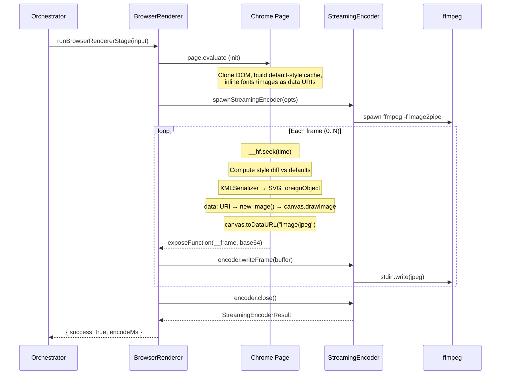

## Summary

Add a new `@hyperframes/browser-renderer` package that captures composition frames via SVG foreignObject serialization inside a single `page.evaluate()` call — eliminating CDP round-trips per frame. This copies the architectural approach that Editframe uses to achieve 25% faster renders (2.84s vs 3.81s on our 10s benchmark). JPEG frame buffers stream back to Node via `exposeFunction` and pipe into the existing `StreamingEncoder` (ffmpeg). Integrates into the orchestrator as a fourth capture path with the established `{ success: false }` fallback cascade.

---

## Problem Frame

HyperFrames' current capture pipeline makes 3 CDP round-trips per frame (seek evaluate, video frame injection, Page.captureScreenshot). On a 300-frame composition, that's ~900 IPC calls costing 34.8ms/frame. The 6-worker parallel architecture amortizes this to ~1.7s effective capture time, but it's still the dominant cost — 72-78% of wall-clock time per benchmarks.

Editframe eliminates this entirely by running the frame loop inside the browser: seek → SVG foreignObject serialize → Image load → OffscreenCanvas draw → encode. Zero CDP calls per frame. Their capture cost is ~9ms/frame for simple compositions.

The goal is to bring this zero-IPC capture architecture to HyperFrames as an opt-in path for compositions that don't need the pixel-perfect CDP compositor (no `<video>`, no HDR, no alpha, no backdrop-filter).

---

## Requirements

- R1. New package `@hyperframes/browser-renderer` with SVG foreignObject serializer + frame loop
- R2. Entire frame capture loop runs inside a single `page.evaluate()` — zero CDP calls per frame
- R3. Integrates with existing `StreamingEncoder` (ffmpeg image2pipe) for encoding
- R4. Gated in the orchestrator: disabled for compositions with `<video>`, HDR, alpha, or png-sequence output
- R5. Falls back gracefully via `{ success: false }` to the existing streaming/disk path
- R6. Handles GSAP-animated compositions: seeks timeline, captures post-animation state
- R7. Resources (fonts, images) pre-inlined during compile stage or at capture init — not re-fetched per frame

---

## Key Technical Decisions

**KTD-1: SVG foreignObject over drawElementImage.** drawElementImage (html-in-canvas API) is 2× faster per-frame but has Chrome 148 bugs: `<head>` stylesheets don't apply inside `layoutsubtree` canvases, overlapping absolute-positioned layers block each other's paint, and elements need `display:none` toggling for scene switching. SVG foreignObject is battle-tested (dom-to-image, html-to-image, snapdom all ship it) and handles any DOM structure. The tradeoff is ~5ms overhead per frame for serialization + Image load, and no support for `backdrop-filter`/3D transforms — acceptable for the gated compositions this targets.

**KTD-2: Fast style diffing, not naive computed style copy.** Copying all ~340 computed properties per element is the #1 foreignObject performance killer. Use the sandbox-iframe approach (dom-to-image-more PR #71): create a default-style reference per tag name, compare against defaults + parent inheritance, copy only the ~7 properties that actually differ. This gives 60% speedup and 11× shorter SVG data URIs.

**KTD-3: Single-worker sequential capture for V1.** Multi-worker foreignObject capture would require each worker page to independently serialize its DOM subtree — the serialization cost scales linearly per worker since there's no shared state. This adds complexity without clear benefit until we measure where the bottleneck actually is. Start single-worker; the fallback to 6-worker CDP is always available.

**KTD-4: Resource inlining at capture init, not per frame.** Fonts and images are static across frames. Inline them once into a cached resource map (data URIs keyed by original URL) before the frame loop starts. Per-frame cost is only: GSAP seek + compute style diff + serialize changed properties + XMLSerializer + Image load + canvas drawImage + toDataURL.

**KTD-5: Transfer via toDataURL → exposeFunction → StreamingEncoder.** This is the same transport Editframe uses for its non-WebCodecs fallback. Each 1920×1080 JPEG at quality 0.92 is ~200KB → ~270KB as base64. For 300 frames that's ~80MB of string IPC. The alternative (CDP binary transfer) would reintroduce per-frame CDP calls, defeating the purpose. Accept the base64 overhead; it's still faster than 3 CDP round-trips per frame when serialization + Image load is fast enough.

---

## Scope Boundaries

### In Scope

- SVG foreignObject DOM serializer (runs in browser)
- Fast computed-style diffing with default elimination
- Font and image resource inlining (pre-frame-loop)
- Canvas element snapshot handling
- Frame capture loop with GSAP timeline seeking
- Orchestrator integration as a new capture stage
- Benchmark harness comparing old vs new path

### Out of Scope

- WebCodecs VideoEncoder (not available in headless Chrome for Testing)
- Multi-worker parallelism (V2 — measure first)
- `backdrop-filter`, 3D transforms, CSS animations capture (foreignObject limitations)
- Compositions with `<video>` elements (need video frame injection which is CDP-side)
- HDR or alpha-transparent output
- Shader transition compositing

### Deferred to Follow-Up Work

- Multi-worker foreignObject capture (parallel pages each serializing their frame range)
- Hardware encoding integration (h264_videotoolbox with the new path)
- WebCodecs VideoEncoder when Chrome adds it to headless mode
- Compress mode (snapdom-style CSS class deduplication) for complex DOMs
- Regression test golden baselines for the new path

---

## High-Level Technical Design



The entire "Each frame" loop runs inside one `page.evaluate()` — the exposeFunction callback is the only IPC crossing per frame.

---

## Output Structure

```
packages/browser-renderer/
├── package.json
├── tsconfig.json
├── src/
│   ├── index.ts                    # Package exports
│   ├── foreignObjectSerializer.ts  # DOM → SVG foreignObject (runs in-browser)
│   ├── resourceInliner.ts          # Font + image → data URI cache (runs in-browser)
│   ├── styleResolver.ts            # Fast computed-style diffing (runs in-browser)
│   ├── browserCapture.ts           # page.evaluate frame loop + exposeFunction bridge
│   └── captureStage.ts             # Orchestrator stage wrapper
└── tests/
    ├── foreignObjectSerializer.test.ts
    ├── styleResolver.test.ts
    └── browserCapture.test.ts
```

---

## Implementation Units

### U1. Package scaffold and build config

**Goal:** Create the `@hyperframes/browser-renderer` workspace package with TypeScript config, exports, and workspace wiring.

**Requirements:** R1

**Dependencies:** None

**Files:**
- `packages/browser-renderer/package.json` (create)
- `packages/browser-renderer/tsconfig.json` (create)
- `packages/browser-renderer/src/index.ts` (create)
- `package.json` (modify — add to workspaces and build order)

**Approach:** Follow the existing package patterns — `workspace:^` for engine/producer deps, `tsc` for build, same TypeScript strict config as engine. Export surface is minimal: `runBrowserRendererStage` + types.

**Patterns to follow:** `packages/engine/package.json` for package structure, `packages/engine/tsconfig.json` for compiler config.

**Test expectation:** none — pure scaffolding

**Verification:** `bun run build` succeeds including the new package. `import { runBrowserRendererStage } from "@hyperframes/browser-renderer"` resolves.

---

### U2. SVG foreignObject serializer

**Goal:** Implement the in-browser DOM-to-SVG-foreignObject serializer that produces a self-contained SVG data URI from a DOM subtree.

**Requirements:** R2, R6

**Dependencies:** U1

**Files:**
- `packages/browser-renderer/src/foreignObjectSerializer.ts` (create)
- `packages/browser-renderer/src/styleResolver.ts` (create)
- `packages/browser-renderer/src/resourceInliner.ts` (create)
- `packages/browser-renderer/tests/foreignObjectSerializer.test.ts` (create)
- `packages/browser-renderer/tests/styleResolver.test.ts` (create)

**Approach:** Three modules that compose into the serialization pipeline:

`styleResolver.ts` — Fast computed-style diffing:
- On init: create a hidden iframe sandbox, compute default styles per tag name, cache them
- Per element: compare computed styles against defaults + parent, return only the diff set
- Handle `width`/`height` specially (computed value is always px, default is `auto`)

`resourceInliner.ts` — One-time resource inlining:
- Walk the cloned DOM, find all `` src, `background-image: url(...)`, `@font-face` src
- Fetch each unique URL, convert to base64 data URI via FileReader
- Cache in a `Map<string, string>` for reuse across frames
- Handle `<canvas>` elements: snapshot via `toDataURL('image/png')`, replace with ``
- Handle tainted canvases: catch SecurityError, replace with solid-color placeholder

`foreignObjectSerializer.ts` — The main serializer:
- Deep-clone the target element
- Apply style diffs from `styleResolver` to each cloned node
- Apply resource replacements from `resourceInliner`
- Serialize pseudo-elements (`::before`, `::after`) as inline `<style>` blocks on the clone
- Serialize via `XMLSerializer.serializeToString(clone)`
- Wrap in `<svg xmlns="..."><foreignObject width="100%" height="100%"><body xmlns="http://www.w3.org/1999/xhtml">...</body></foreignObject></svg>`
- Return as `data:image/svg+xml;charset=utf-8,` + `encodeURIComponent(svg)`

**Patterns to follow:** dom-to-image-more's `copyUserComputedStyleFast` for the style diffing pattern. html-to-image's font embedding via `getFontEmbedCSS()` for the resource caching pattern.

**Test scenarios:**
- Serialize a div with inline styles → SVG data URI loads as Image and draws non-blank canvas
- Serialize a div with GSAP-applied opacity/transform → captured state reflects GSAP values
- Style resolver: element with non-default font-size returns only the differing properties
- Style resolver: child inheriting parent color does not redundantly inline color
- Resource inliner: `` replaced with `data:image/...` in clone
- Resource inliner: `<canvas>` element replaced with `` snapshot
- Resource inliner: tainted canvas replaced with placeholder, no SecurityError thrown
- Serializer handles void elements (`<br>`, ``) without XHTML errors

**Verification:** Unit tests pass. A manually constructed DOM subtree round-trips through serialize → Image → canvas → getImageData with correct pixel values.

---

### U3. In-browser frame capture loop

**Goal:** Implement the `page.evaluate()` frame loop that seeks the GSAP timeline, serializes each frame via foreignObject, and streams JPEG data back to Node.

**Requirements:** R2, R3, R6, R7

**Dependencies:** U2

**Files:**
- `packages/browser-renderer/src/browserCapture.ts` (create)
- `packages/browser-renderer/tests/browserCapture.test.ts` (create)

**Approach:** Two phases inside `page.evaluate()`:

Phase 1 — Init (runs once):
- Find composition root via `[data-composition-id]`
- Find GSAP timeline via `window.__timelines`
- Create the style resolver (sandbox iframe + default cache)
- Run resource inliner on the composition DOM (fonts + images → data URIs)
- Create the capture canvas (`OffscreenCanvas` or regular canvas at composition dimensions)

Phase 2 — Frame loop:
- For each frame index in the assigned range:
  - Seek: `window.__hf.seek(timeMs)` (HyperFrames runtime handles clip visibility + GSAP)
  - Wait: `requestAnimationFrame` for paint
  - Serialize: `foreignObjectSerializer.serialize(root)` → SVG data URI
  - Load: `new Image()` + `img.src = dataUri` + await `onload`
  - Draw: `ctx.drawImage(img, 0, 0, width, height)`
  - Export: `canvas.toDataURL('image/jpeg', quality)` → call `exposeFunction` bridge

Node-side bridge (outside page.evaluate):
- `page.exposeFunction('__hf_fo_frame', callback)` receives base64 JPEG strings
- Strips data URI prefix, decodes to Buffer, writes to `StreamingEncoder.writeFrame()`
- Progress reporting via a second exposeFunction

**Patterns to follow:** The existing `captureStreamingStage.ts` for the encoder lifecycle (spawn → write → close → result). The HyperFrames runtime's `window.__hf.seek()` protocol for deterministic frame seeking.

**Test scenarios:**
- Frame loop captures 10 frames from a simple GSAP composition, all non-blank
- Frame loop at t=0 produces different pixel data than t=5 (animation state changes)
- Progress callback fires at expected intervals
- Abort signal cancels the loop mid-capture
- Missing `window.__hf` returns `{ success: false }` (no runtime → fallback)
- Missing `window.__timelines` returns `{ success: false }`

**Verification:** Integration test: load a composition HTML, run the frame loop, verify output frames are non-blank and animation state varies across frames.

---

### U4. Orchestrator integration as capture stage

**Goal:** Wire the browser renderer into the orchestrator's capture path decision tree, gated appropriately, with fallback to existing paths.

**Requirements:** R4, R5

**Dependencies:** U3

**Files:**
- `packages/browser-renderer/src/captureStage.ts` (create)
- `packages/producer/src/services/renderOrchestrator.ts` (modify)

**Approach:**

New gate function `shouldUseBrowserRenderer()`:
- `cfg.enableBrowserRenderer` must be true (default: false for V1 — opt-in)
- `outputFormat !== "png-sequence"`
- `composition.videos.length === 0` (no video elements)
- `!needsAlpha`
- `!hasHdrContent`
- `!compiled.hasShaderTransitions`

Stage wrapper `runBrowserRendererStage()`:
- Creates or reuses a `CaptureSession` (same as streaming stage)
- Spawns `StreamingEncoder` with the same options the streaming stage uses
- Calls the in-browser capture loop from U3
- Returns `{ success: true, encodeMs, probeSession, lastBrowserConsole, workerCount: 1 }` or `{ success: false }`

Orchestrator insertion point — between the `useLayeredComposite` block and the `useStreamingEncode` block (line ~1884 in current orchestrator):
```
if (useLayeredComposite) → HDR path
else {
  if (useBrowserRenderer) → new foreignObject path (falls back on failure)
  if (!handled && useStreamingEncode) → existing streaming path
  if (!handled) → disk path + encode
}
```

New config field on `EngineConfig`: `enableBrowserRenderer: boolean` (default `false`).

**Patterns to follow:** `captureStreamingStage.ts` for the stage input/result types and the fallback pattern. `shouldUseStreamingEncode()` for the gate function pattern.

**Test scenarios:**
- Gate returns true when all conditions met (no videos, no HDR, no alpha, config enabled)
- Gate returns false when composition has `<video>` elements
- Gate returns false when config flag is off
- Stage returns `{ success: false }` when foreignObject serializer throws, and orchestrator falls through to streaming path
- Stage returns `{ success: true }` with valid video file when composition is simple text + GSAP

**Verification:** Render the Pavla benchmark composition with `enableBrowserRenderer: true`. Output video has correct content at t=2s, t=5s, t=9s. Render time is measurably different from the CDP path.

---

### U5. Benchmark harness

**Goal:** Add a benchmark script that compares the browser renderer path against the existing CDP path on the same composition, measuring capture time, encode time, and output quality.

**Requirements:** Validates the performance claim

**Dependencies:** U4

**Files:**
- `packages/browser-renderer/bench/compare.ts` (create)

**Approach:** Script that:
1. Renders the same composition 3× with `enableBrowserRenderer: false` (CDP baseline)
2. Renders the same composition 3× with `enableBrowserRenderer: true` (foreignObject path)
3. Compares: median render time, output file size, per-frame capture ms
4. Extracts frames at t=2s, t=5s, t=9s from both outputs for visual diff
5. Reports results as a markdown table

**Patterns to follow:** `packages/producer/tests/perf/README.md` for benchmark conventions.

**Test expectation:** none — benchmark tooling, not feature code

**Verification:** Script runs end-to-end, produces comparison table with timing data and frame screenshots.

---

## Risks & Dependencies

| Risk | Likelihood | Impact | Mitigation |
|------|-----------|--------|------------|
| SVG foreignObject serialization too slow for 1920×1080 DOM | Medium | High | Fast style diffing + resource caching. Measure per-frame cost; if >30ms, the path is slower than CDP and the gate should disable it |
| base64 toDataURL → exposeFunction IPC overhead negates capture savings | Medium | High | Measured at ~17ms/frame in our earlier benchmark. Combined with ~9ms serialize, total ~26ms/frame vs 34.8ms CDP — marginal win. If too close, defer to V2 multi-worker |
| CSS rendering differences (foreignObject vs compositor) | Low | Medium | Gate to simple compositions only. Accept known limitations (no backdrop-filter, no 3D). Visual diff in benchmark harness catches regressions |
| GSAP-animated styles not captured correctly in foreignObject | Low | High | foreignObject captures computed styles which include GSAP's inline style overrides. Verified in our earlier tests that GSAP `.from()` opacity is captured correctly. requestAnimationFrame wait ensures paint cycle |

---

## Sources & Research

- Editframe render pipeline reverse-engineering (this session) — SVG foreignObject serialization + WebCodecs encode architecture
- dom-to-image-more PR #71 — `copyUserComputedStyleFast` optimization (60% speedup, 11× shorter URIs)
- html-to-image — TypeScript implementation with font embedding + canvas snapshot handling
- snapdom — Compress mode, smart font detection, caching strategies
- Benchmark data: CDP capture 34.8ms/frame, drawElementImage 17.0ms/frame, Editframe ~9ms/frame
- HyperFrames capture dominance: 72-78% of wall-clock time is frame capture (producer perf README)
